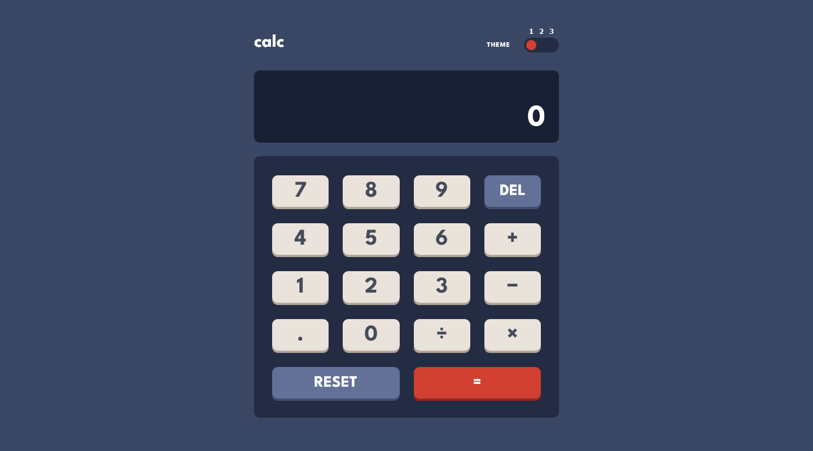
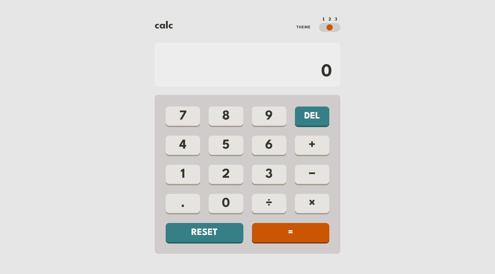
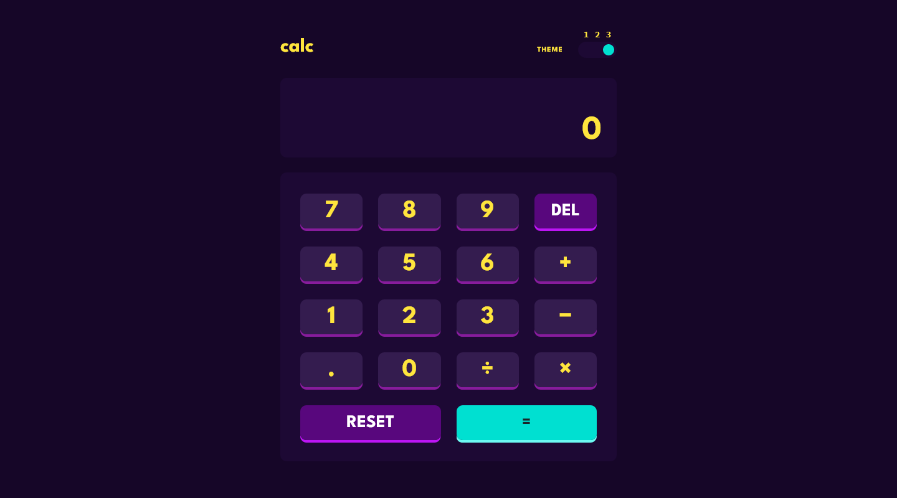

  
  <h2 align="left">Frontend Mentor - Calculator app solution</h2>

This is a solution to the [Calculator app challenge on Frontend Mentor](https://www.frontendmentor.io/challenges/calculator-app-9lteq5N29). Frontend Mentor challenges help you improve your coding skills by building realistic projects.

<!--  -->

&dot;
 
&dot;

---

### The challenge

Users should be able to:

- See the size of the elements adjust based on their device's screen size
- Perform mathmatical operations like addition, subtraction, multiplication, and division
- Adjust the color theme based on their preference
- **Bonus**: Have their initial theme preference checked using `prefers-color-scheme` and have any additional changes saved in the browser

### Screenshot

### Built with

- Semantic HTML5 markup
- CSS custom properties
- CSS Grid
- Mobile-first workflow

---

### Author

- Frontend Mentor - [@mateusbelicio](https://www.frontendmentor.io/profile/mateusbelicio)
- Linkedin - [@mateusbelicio](https://www.linkedin.com/in/mateusbelicio)
